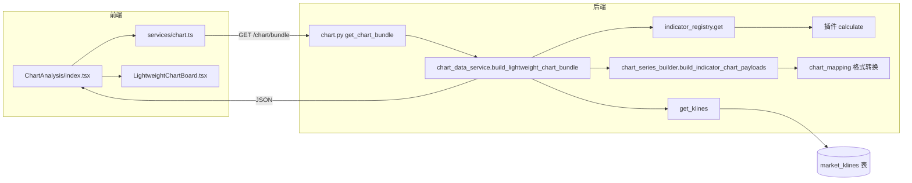

# 图表分析模块开发指南

本文档面向希望**理解或模仿**「图表分析」功能实现的开发者，按**数据流**说明：涉及哪些文件与函数、前端如何调用后端、使用了哪些 API、数据如何存储与**不落库**的设计取舍。

---

## 1. 功能目标与架构概览

| 层级 | 职责 |
|------|------|
| **前端** | 只负责用 **Lightweight Charts** 画图；不直接算指标、不直连交易所。 |
| **后端 API** | 聚合「K 线 + 0～N 个技术指标」为一份 JSON（不依赖 TradingView webhook/兼容接口）。 |
| **指标插件** | 继承 `BaseIndicator`，`calculate(df, params)` 输出 `DataFrame`。 |
| **持久化** | **K 线**从数据库读取；**图表请求中的指标计算结果不写库**（避免每次刷新刷爆 `indicator_results`）。 |



---

## 2. 前端：文件、函数与调用链

### 2.1 页面入口

| 文件 | 作用 |
|------|------|
| [frontend/src/router/index.tsx](../frontend/src/router/index.tsx) | 路由 `path="chart"` → 懒加载/导入 `ChartAnalysis` 组件。 |
| [frontend/src/layouts/BasicLayout.tsx](../frontend/src/layouts/BasicLayout.tsx) | 侧栏菜单项 `/chart`，文案「图表分析」。 |

**页面组件**： [frontend/src/pages/ChartAnalysis/index.tsx](../frontend/src/pages/ChartAnalysis/index.tsx)

| 逻辑 | 说明 |
|------|------|
| 状态 | `symbol`、`timeframe`、`indicatorKeys`（多选）、`bundle`、`loading`、`meta`。 |
| `useEffect` + `indicatorApi.list()` | 拉取可选指标列表，过滤 `chart_compatible !== false`，生成下拉 `options`。 |
| `indicatorsParam` | `indicatorKeys.join(',')`，作为查询参数传给后端。 |
| `load` | 调用 `chartApi.getBundle({ symbol, timeframe, exchange, market_type, limit, indicators, theme, source_mode, use_proxy? })`；当点击“强制刷新”时传 `source_mode=live`（或 `force_refresh=true` 别名）；开关打开才传 `use_proxy=true`，否则后端将使用 env：`BINANCE_PROXY_ENABLED` 来决定是否走代理。把返回的 `data` 写入 `bundle`，`meta` 用于展示 `failed_indicators`。 |
| UI | `Select`（交易对、周期、指标多选）、`Button` 刷新、`Alert` 展示部分指标失败原因、`LightweightChartBoard` 渲染。 |

### 2.2 HTTP 封装（图表专用）

| 文件 | 内容 |
|------|------|
| [frontend/src/services/chart.ts](../frontend/src/services/chart.ts) | 导出 `chartApi.getBundle` 与 TypeScript 类型 `ChartBundle`、`ChartSeriesPayload`、`ChartSubchartGroup`。 |

**实际请求**（依赖 [frontend/src/services/request.ts](../frontend/src/services/request.ts)）：

- `baseURL`：`/api/v1`（Vite 开发时代理到后端）。
- 自动附加 `Authorization: Bearer <token>`（需登录）。
- 方法：`request.get('/chart/bundle', { params })`  
  → 完整 URL：**`GET /api/v1/chart/bundle`**

### 2.3 图表渲染组件

| 文件 | 作用 |
|------|------|
| [frontend/src/components/chart/LightweightChartBoard.tsx](../frontend/src/components/chart/LightweightChartBoard.tsx) | 接收 `bundle: ChartBundle \| null`，用 `lightweight-charts` 的 `createChart` 创建主图与多个副图。 |

**核心逻辑（`useEffect` 内）**：

1. 清空容器、销毁旧 `IChartApi` 实例（`chart.remove()`）。
2. 主图：`addCandlestickSeries()` + `setData(candlestick)`；遍历 `overlays` → `addLineSeries()` + `setData`。
3. 每个 `subcharts[]` 分组：新建一个 `div` + 独立 `createChart`，组内 `series` 按 `type` 为 `line` 或 `histogram` 添加序列。
4. **时间轴同步**：`mainChart.timeScale().subscribeVisibleLogicalRangeChange` → 对副图 `setVisibleLogicalRange`，保证缩放一致。
5. `resize` 监听：调整 `width` 并 `fitContent`。

**依赖 npm 包**：`lightweight-charts`（见 [frontend/package.json](../frontend/package.json)）。

### 2.4 前端用到的 API 一览

| 用途 | 方法 | 路径 | 封装位置 |
|------|------|------|----------|
| 图表数据包 | GET | `/api/v1/chart/bundle` | `chartApi.getBundle` |
| 指标列表（多选数据源） | GET | `/api/v1/indicators/` | `indicatorApi.list`（[frontend/src/services/indicators.ts](../frontend/src/services/indicators.ts)） |

> 图表页不依赖 `/api/v1/tradingview/chart-data`；该 TradingView 接口已移除。

---

## 3. 后端：文件、函数与调用链

### 3.1 路由注册

| 文件 | 内容 |
|------|------|
| [backend/app/api/router.py](../backend/app/api/router.py) | `api_router.include_router(chart.router, prefix="/chart", tags=["图表分析"])` |
| [backend/app/api/v1/chart.py](../backend/app/api/v1/chart.py) | 定义 `GET /bundle` |

### 3.2 API 处理函数

**文件**： [backend/app/api/v1/chart.py](../backend/app/api/v1/chart.py)

| 函数 | 说明 |
|------|------|
| `get_chart_bundle(...)` | FastAPI 路由处理函数。解析 Query：`symbol`、`timeframe`、`exchange`、`market_type`、`limit`、`indicators`（逗号分隔）、`theme`，以及 `source_mode=cache|live`（支持 `force_refresh=true` 别名）与 `use_proxy?`（不传则使用 env：`BINANCE_PROXY_ENABLED`）。依赖注入：`get_db`、`get_current_user`（必须登录）。将 `indicators` 拆成列表后调用 `build_lightweight_chart_bundle`；成功则 `ResponseBase(data=bundle)`；`ValueError`（无 K 线）返回 `code=400`。 |

### 3.3 业务编排（核心）

**文件**： [backend/app/services/chart_data_service.py](../backend/app/services/chart_data_service.py)

| 函数 | 说明 |
|------|------|
| `build_lightweight_chart_bundle(db, *, exchange, market_type, symbol, timeframe, limit, indicator_keys, theme, source_mode, use_proxy)` | ① 通过 `MarketDataProvider.get_klines(..., source_mode, use_proxy)` 获取 K 线；② `klines_to_tv_format` + `build_chart_config` 生成蜡烛与主题配置；③ 构建 `kline_df`（pandas）；④ 对每个 `indicator_key`：`runtime.is_indicator_load_enabled`、`indicator_registry.get`、`validate_params({})`、`calculate(kline_df, validated)`；⑤ `build_indicator_chart_payloads` 拆成 overlays/subcharts；⑥ 汇总 `meta.failed_indicators`。 |

**刻意不做的事**：不调用 `indicator_service.calculate_indicator`（该函数会**写入** `indicator_results` 表）。图表页每次刷新若落库会产生大量记录。

### 3.4 K 线查询（持久化读）

**文件**： [backend/app/services/market_service.py](../backend/app/services/market_service.py)

| 函数 | 说明 |
|------|------|
| `get_klines(db, exchange, symbol, market_type, interval, start_time?, end_time?, limit)` | 查询表 **`market_klines`**（模型 [backend/app/models/market_kline.py](../backend/app/models/market_kline.py)），按 `open_time` **升序**，限制条数。 |

K 线**写入**来自采集/种子脚本/交易所适配器等（不在本文图表链路内展开），图表模块只**读**。

### 3.5 指标序列 JSON 组装

**文件**： [backend/app/services/chart_series_builder.py](../backend/app/services/chart_series_builder.py)

| 函数 | 说明 |
|------|------|
| `_resolve_field_template` | 把 `display_config.series[].field` 里的 `{period}` 等占位符换成 `validate_params` 后的真实列名（如 `ema_20`）。 |
| `_column_to_time_value_list` | 从 `result_df` 取一列，生成带 `time`/`value`（及柱状图着色 `color`）的点列表。 |
| `build_indicator_chart_payloads(indicator_cls, indicator_key, result_df, validated_params)` | 若存在 `display_config.series`：按 `panel` 分主图（overlay）与副图（sub）；否则用 `get_indicator_chart_config` 的默认 `display_type` 走单序列兜底。内部调用 `chart_mapping.indicator_to_tv_overlay` / `indicator_to_tv_pane`。 |

### 3.6 图表格式兼容层（Lightweight Charts）

**文件**： [backend/app/lightweight_charts_compat/chart_mapping.py](../backend/app/lightweight_charts_compat/chart_mapping.py)

| 函数 | 说明 |
|------|------|
| `klines_to_tv_format(klines)` | 内部 K 线 dict → `{ time, open, high, low, close, volume }`（`time` 为 Unix 秒）。 |
| `build_chart_config(symbol, interval, theme)` | 生成前端 `createChart` 可用的 `chart_options`、`candlestick_options`（颜色主题）。 |
| `get_indicator_chart_config(indicator_key)` | 指标默认主图叠加或副图、颜色、线宽等（`_INDICATOR_CHART_MAP`）。 |
| `indicator_to_tv_overlay` / `indicator_to_tv_pane` | 点列表 → `{ name, type, data, options }`，供前端映射到 `LineSeries` / `HistogramSeries`。 |

### 3.7 指标插件（计算发生处）

**文件**：各指标类，如 [backend/app/indicators/builtins/ema.py](../backend/app/indicators/builtins/ema.py)、`rsi.py`、`macd.py` 等。

| 方法 | 说明 |
|------|------|
| `BaseIndicator.validate_params` | 补全默认参数。 |
| `BaseIndicator.calculate(df, params)` | 输入与 K 线对齐的 `DataFrame`，输出含 `open_time` 及指标列的 `DataFrame`。 |
| `display_config`（类属性） | `panel: main|sub`、`series[]`（`field`、`type`、`color` 等），供 `chart_series_builder` 拆分多序列（如 MACD 三轨）。 |

**注册表**： [backend/app/indicators/registry.py](../backend/app/indicators/registry.py) — `indicator_registry.get(indicator_key)` 取类。

### 3.8 插件运行时（禁用「不加载」）

**文件**： [backend/app/services/plugin_runtime_service.py](../backend/app/services/plugin_runtime_service.py)（通过 `get_plugin_runtime_service()`）

图表链路中会调用 `is_indicator_load_enabled(indicator_key)`；若在 `plugin_runtime.yaml` 中禁用，则该指标进入 `meta.failed_indicators`，不计算。

---

## 4. 数据存储说明（重要）

| 数据 | 是否读写 | 说明 |
|------|----------|------|
| **K 线** | **读** `market_klines` | 图表能画的先决条件；需提前导入/采集。 |
| **指标计算结果（图表请求）** | **不写** | 仅在内存中 `calculate`，避免刷屏落库。 |
| **指标计算结果（指标页「计算」）** | **写** `indicator_results` | 由 [backend/app/services/indicator_service.py](../backend/app/services/indicator_service.py) 的 `calculate_indicator` 完成，与图表 bundle **不是同一路径**。 |

模仿开发时若要「图表也算一份历史结果落库」，需**新增**明确需求，否则保持当前「只读 K 线 + 内存算指标」即可。

---

## 5. 响应 JSON 结构（约定）

成功时 `ResponseBase.data` 大致为：

```text
config          # build_chart_config：chart_options、candlestick_options、symbol、interval
candlestick[]   # klines_to_tv_format：OHLCV + time
overlays[]      # 主图折线：name、type、data[{time,value}]、options
subcharts[]     # { title, series[] }，series 同 overlays 结构，可含 histogram
markers[]       # 当前固定 []，预留信号标记
meta            # klines_loaded、indicators_requested、failed_indicators 等
```

前端类型见 [frontend/src/services/chart.ts](../frontend/src/services/chart.ts)。

---

## 6. 历史接口说明（已移除）

本仓库现在统一使用 `GET /api/v1/chart/bundle`（`chartApi.getBundle`）返回 Lightweight Charts 兼容数据包。

旧版 TradingView 相关的图表接口已移除，不再作为图表分析页面的数据来源。

---

## 7. 模仿开发：推荐步骤清单

1. **后端**：在 `chart_data_service` 中保持「只读 K 线、内存算指标」；若增加新查询参数，同步修改 `chart.py` 的 Query 与前端 `chartApi.getBundle`。
2. **新指标**：在 `app/indicators/builtins`（或 `custom`）实现 `calculate` + `display_config.series`；注册后无需改 `chart.py` 即可用 key 请求。
3. **前端**：在 `ChartAnalysis` 增加筛选条件 → 传给 `getBundle`；若 JSON 结构扩展，先改 `chart.ts` 类型，再改 `LightweightChartBoard` 映射到 Lightweight Charts API。
4. **验收**：Swagger `GET /api/v1/chart/bundle` 与登录后 `/chart` 页面行为一致；无 K 线时应出现 400 或友好提示（由响应拦截器统一处理）。

---

## 8. 相关文档索引

- [开发指南.md](./开发指南.md) — 全局路由与 API 对照。
- [README.md](../README.md) — 「图表分析」小节与快速说明。

---

*文档版本与图表 bundle 实现保持一致；若你修改了 `chart_data_service` 或响应结构，请同步更新本节。*
